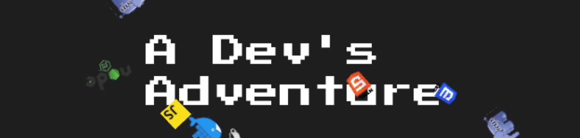

# A Dev's Adventure

  

I started this project because I wanted to make an original and unique portfolio, showing some of my skills and explaining my professional experience in a different way. The result is this micro RPG (it can be completed in a few minutes) which is about my day-to-day professional life, but other people are likely to feel identified. If you play it you will be able to know more about me. I hope you like the game!

You can play the game in three different languages:

- [English](https://albert-gonzalez.github.io/a-dev-adventure-game/)
- [Catalan](https://albert-gonzalez.github.io/a-dev-adventure-game/index.ca.html)
- [Spanish](https://albert-gonzalez.github.io/a-dev-adventure-game/index.es.html)

## Credits

This game is possible thanks to all these resources and their creators:

<ul>
  <li>
    <a href="https://phaser.io/">Phaser Game Framework</a>
  </li>
  <li>
    <a href="https://www.mapeditor.org/">Tiled Map Editor</a>
  </li>
  <li>
    <a href="https://pipoya.itch.io/pipoya-rpg-tileset-32x32"
      >RPG Tileset 32x32 - Pipoya</a
    >
  </li>
  <li>
    <a href="https://limezu.itch.io/moderninteriors"
      >Modern Interiors Tileset - LimeZu</a
    >
  </li>
  <li>
    <a href="https://opengameart.org/content/jrpg-town-music"
      >JRPG Town Music - Scott Elliott</a
    >
  </li>
  <li>
    <a href="https://opengameart.org/content/rpg-town-theme-1"
      >JRPG Town Theme - LarsG</a
    >
  </li>
  <li>
    <a href="https://opengameart.org/content/prologue-theme"
      >Prologue Music - Cleyton Kauffman</a
    >
  </li>
  <li>
    <a href="https://opengameart.org/content/boss-battle-theme"
      >Boss Battle Theme- Cleyton Kauffman</a
    >
  </li>
  <li>
    <a href="https://opengameart.org/content/win-music-2"
      >Win Music - Remaxim</a
    >
  </li>
  <li>
    <a href="https://opengameart.org/content/game-over"
      >Game Over Music - Kistol</a
    >
  </li>
  <li>
    <a href="https://opengameart.org/content/the-epic-adventure-album"
      >The Epic Adventure Album - Northivanastan</a
    >
  </li>
  <li>
    <a href="https://opengameart.org/content/menu-selection-click"
      >Menu selection click - NenadSimic</a
    >
  </li>
  <li>
    <a href="https://opengameart.org/content/steam-release-sounds"
      >Steam release sounds - Bart</a
    >
  </li>
  <li>
    <a href="https://opengameart.org/content/water-flowing-sound"
      >Water flowing sound - Erxer1</a
    >
  </li>
  <li>
    <a href="https://opengameart.org/content/single-key-press-sounds"
      >Single key press sounds - Eklee</a
    >
  </li>
  <li>
    <a href="https://opengameart.org/content/battle-sound-effects"
      >Battle Sound Effects - Ogrebane</a
    >
  </li>
  <li>
    <a href="https://opengameart.org/content/monster-sound-pack-volume-1"
      >Monster sound pack volume 1 - Ogrebane</a
    >
  </li>
  <li>
    <a href="https://opengameart.org/content/replenish-life-force-sound"
      >Replenish life force sound - Iwan Gabovitch</a
    >
  </li>
  <li>
    <a href="https://opengameart.org/content/book-pages"
      >Book Pages - Spookymodem</a
    >
  </li>
  <li>
    <a href="https://opengameart.org/content/chunky-explosion"
      >Chunky Explosion - Joth</a
    >
  </li>
  <li>
    <a href="https://opengameart.org/content/magic-spell-sfx"
      >Magic Spell SFX - JaggedStone</a
    >
  </li>
  <li>
    <a
      href="https://commons.wikimedia.org/wiki/File:Unofficial_JavaScript_logo_2.svg"
      >Javascript Logo - Wikimedia</a
    >
  </li>
  <li>
    <a href="https://nodejs.org/ca/about/resources/">Node.js Logo - Node.js</a>
  </li>
  <li>
    <a
      href="https://commons.wikimedia.org/wiki/File:HTML5_logo_and_wordmark.svg"
      >HTML Logo - Wikimedia</a
    >
  </li>
  <li>
    <a href="https://commons.wikimedia.org/wiki/File:CSS3_logo_and_wordmark.svg"
      >CSS Logo - Wikimedia</a
    >
  </li>
  <li>
    <a
      href="https://commons.wikimedia.org/wiki/File:Webysther_20160423_-_Elephpant.svg"
      >PHP Elephant - Wikimedia</a
    >
  </li>
  <li>
    <a href="https://www.docker.com/company/newsroom/media-resources"
      >Docker Logo - Docker</a
    >
  </li>
  <li>
    <a href="https://icon-icons.com/icon/catalonia-flag/106770">
      Catalonia Flag - Icon Icons</a
    >
  </li>
  <li>
    <a href="https://www.flaticon.com/free-icon/united-kingdom_197374"
      >UK Flag - Flaticon</a
    >
  </li>
  <li>
    <a href="https://icon-icons.com/icon/flag-spain/106784"
      >Spain Flag - Icon Icons</a
    >
  </li>
  <li>
    <a href="https://slayersclub.bethesda.net/en/media#wallpapers"
      >Doom Artwork - Bethesda</a
    >
  </li>
</ul>
